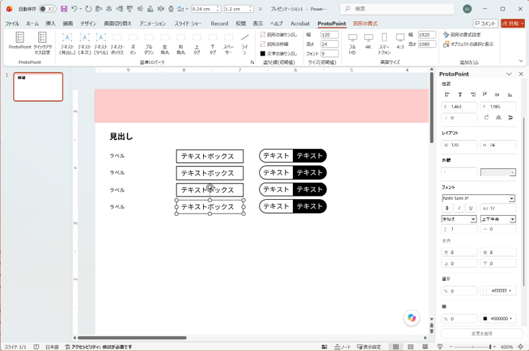

# ProtoPoint

**PowerPointを、そのままUIプロトタイピングツールに。**

ProtoPointは、Windows版PowerPointで通常の図形を使いながら、UIプロトタイプをすばやく作成するためのアドインです。

テキストボックス、ボタン、プルダウン、タブなどの基準UIパーツをワンクリックで配置し、右側の専用パネルから寸法・文字・色・線・角丸・効果などを調整できます。

作成される要素はPowerPoint標準の図形です。  
**ProtoPointが入っていない環境でも、そのままPowerPointで表示・編集できます。**

[最新版をダウンロード](../../releases/latest)

## 主な特徴

- PowerPoint標準図形だけでUIプロトタイプを作成
- ボタン、プルダウン、テキストボックス、タブなどをワンクリックで配置
- 右側のProtoPointパネルから寸法・文字・色・線・角丸・効果を調整
- UI向けの論理フォントサイズ・線幅に対応
- 基準UIパーツの初期値を編集・追加・削除・並べ替え可能
- 任意のスライドサイズで利用可能
- ProtoPointがない環境でも通常のPowerPointとして編集可能

## スクリーンショット

© 2026 Seasalt Lab.

## 動作環境

- Windowsとデスクトップ版Microsoft PowerPoint
- .NET Framework 4.8以降、Officeの.NETプログラミングサポート
- Microsoft 365 PowerPoint 64bitで動作確認済み
- 標準フォント：Noto Sans JP。未インストールの場合はPowerPointの代替フォントが使用されます。

## インストール

1. ZIPを展開し、フォルダを継続して使用する場所へ置きます。
2. PowerPointをすべて閉じます。
3. `install.cmd`を実行します。現在のWindowsユーザーに登録されます。
4. PowerPointを起動し、「ProtoPoint」タブを開きます。

登録後にフォルダを移動した場合は、移動先の`install.cmd`を実行し直してください。更新時もPowerPointを閉じ、更新版を展開してから登録します。組織のポリシーでアドインが制限されている場合は管理者へお問い合わせください。

## 使い方

- 「基準UIパーツ」のボタンで、現在のスライドへ図形を挿入します。
- 図形を選ぶと、右の「ProtoPoint」で文字、寸法、色、線、角丸、影、光彩などを調整できます。グループ内の図形も、個別に選択して編集できます。
- 数値や文字は「変更を適用」、または数値欄でEnterを押すと反映されます。
- 基準UIパーツの右下にある小さな起動アイコンから、初期値の編集・追加・削除・並べ替えができます。「保存」で確定します。
- 「画面サイズ」でスライドサイズを選択できます。
- 「追加カラム」からPowerPoint標準の書式設定や選択ウィンドウを開けます。

## 基準UIパーツ

テキスト（見出し・本文・ラベル）、テキストボックス、ボタン、プルダウン、左右角丸、上下タブ、スペーサー、ラインを用意しています。

フォントはNoto Sans JP、線幅の初期値はUI値1です。テキストとスペーサーの線は非表示です。各パーツの初期値は詳細設定で変更できます。

## 数値の扱い

| 項目 | 入力値 |
|---|---|
| 幅・高さ・余白・角の半径 | 100 = 1cm |
| X・Y | cm |
| フォントサイズ | UI論理値。12 → PowerPointの3.4pt |
| 線幅 | UI論理値。1 → PowerPointの約0.283pt |
| 透明度 | 0%が不透明、100%が透明 |
| 影のぼかし・距離、光彩サイズ・文字間隔 | PowerPointのpt |
| 行間 | 倍数 |

## クイックアクセス設定

「ProtoPoint」の右隣から、整列・均等配置・回転・高さ・幅の追加を設定できます。確認画面で「はい」を選び、PowerPointをすべて閉じた後、次の起動から反映されます。既存の設定はバックアップされます。

## アンインストール

PowerPointをすべて閉じ、`uninstall.cmd`を実行してください。作成したPowerPointファイルと保存済みの初期値は残ります。

初期値の保存先：`%LOCALAPPDATA%\PowerPointUiPrototype\presets.xml`

## フィードバック

不具合の報告や機能の提案は、GitHub Issuesからお願いします。

- [不具合を報告する](../../issues/new/choose)
- [機能を提案する](../../issues/new/choose)
